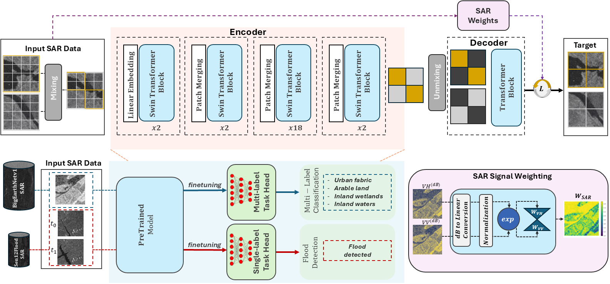

# SAR-W-MixMAE: Polarization‑Aware Self‑Supervised Pretraining for Masked Autoencoders on SAR Data

This repository contains the code for the paper **“SAR-W-MixMAE: Polarization‑Aware Self‑Supervised Pretraining for Masked Autoencoders on SAR Data.”**  
It builds on MixMIM/MixMAE with a Swin backbone and adds **polarization-aware reconstruction weighting**.

**How the weighting works (two variants):**
- From **linear-scale** VH/VV, we normalize each pixel to $\[0,1\]$ and compute
  $\( w_c = \exp(1 - \tilde{x}_c) \)$ for channel $\( c \in \{ \mathrm{VH}, \mathrm{VV} \} \)$.
- We then aggregate per-pixel weights to patch/token weights and scale the token-wise MSE.

**Variants**
1. **Per-channel weighting:** use $\( w_{\mathrm{VH}} \)$ for VH tokens and $\( w_{\mathrm{VV}} \)$ for VV tokens.
2. **Shared-avg weighting:** use a single map $\( w = \tfrac{1}{2}(w_{\mathrm{VH}} + w_{\mathrm{VV}}) \)$ for both channels.

**Domain policy:** inputs to the encoder are **in dB**, while weighting is computed **in linear** for consistency with the physical backscatter scale.



## Highlights
- Swin + MixMIM/MixMAE pretraining with mask ratio `r = 0.5`, input `2×128×128 (VH, VV)`.
- Polarization‑aware pixel weights → aggregated token weights for reconstruction MSE.
- Strong results on **BigEarthNet v1/v2** (multi‑label) and **SEN12‑FLOOD** fine‑tuning.
- Upstream files from MixMIM are redistributed **with written permission (2025‑10‑15)** and tagged `SPDX: NOASSERTION`; all original files here are **MIT**.

## Repository Layout
```
SAR-W-MixMAE/
  main_pretrain.py            # modified from MixMIM (NOASSERTION)
  main_finetune.py            # modified from MixMIM (NOASSERTION)
  engine_pretrain.py          # modified from MixMIM (NOASSERTION)
  engine_finetune.py          # modified from MixMIM (NOASSERTION)
  models_mixmim.py            # modified from MixMIM (NOASSERTION)
  models_mixmim_ft.py         # modified from MixMIM (NOASSERTION)
  models_sen12_ft.py          # new, derived from MixMIM FT (NOASSERTION)

  util/                       # upstream MixMIM files (verbatim or lightly modified) — NOASSERTION
    pos_embed.py (verbatim), lr_sched.py (verbatim), lr_decay.py (verbatim),
    datasets.py (verbatim), crop.py (verbatim), misc.py (modified), README.md

  sarwmix/                    # all original utilities — MIT
    bigearthnetv1.py, bigearthnetv2.py, helper.py,
    sen12_align_s1_to_s2.py, sen12_data_prep.py, sen12_prune_partial_pairs.py,
    sen12flood_loader.py, weighting.py

  scripts/                    # all original runner scripts — MIT
    qsub_run.sh, run_local.sh # runners for ABCI/local
    prepare_sen12flood.sh     # SEN12FLOOD end-to-end prep (align→pair→clean)

  analysis/                   # log parsing, metrics, and figure helpers — MIT
    exponential_2_n_epoch.py
    exponential_2_n_training.py
    logfile_reader.py
    logfile_time_process.py
    train_data_sampling.py

  datasets/                   # CSVs/splits and metadata (e.g., S1list.json) — MIT
  LICENSES/                   # MIT.txt, NOASSERTION.txt
  NOTICE                      # provenance + permission note
  THIRD_PARTY.md              # file-by-file mapping table
  CITATION.cff
  requirements.txt
  INSTALL.md
  README_benv1.md
  README_sen12.md
  README.md
```

---

## Installation (Python 3.12, CUDA 12.x)

We recommend: install PyTorch first (matching your CUDA), then the rest of the Python deps.

```bash
# 1) Create env
conda create -n sarwmix python=3.12 -y
conda activate sarwmix

# 2) Install PyTorch (choose the right CUDA build)
# Example for CUDA 12.x:
pip3 install torch torchvision --index-url https://download.pytorch.org/whl/cu126

# 3) Install repo dependencies (Torch is intentionally excluded from requirements.txt)
pip install -r requirements.txt
```

> If you build from source or use a system CUDA, verify `torch.cuda.is_available()` and that the CUDA versions match.

---

## Datasets

### BigEarthNet‑v2 (BENv2)
- Input: Sentinel‑1 GRD; we use **VH,VV** channels, **2×128×128** patches.
- You can load BENv2 with the provided dataset class:
  ```python
  from sarwmix.bigearthnetv2 import BigEarthNetv2
  ```
- Expected usage: training splits via CSVs in `datasets/`.

### BigEarthNet‑v1 (BENv1)
- Legacy support; some loaders expect **Zarr** containers.
- Use `sarwmix/bigearthnetv1.py` and train/val/test splits together with labels in `datasets/`.
- **Migration guide:** see [README_benv1.md](README_benv1.md).

### SEN12-FLOOD (fine-tuning only)

- **what**: binary flood detection on pairwise SAR (VV/VH) inputs. each sample has two timepoints  
`(img1 = non-flood, img2 = flood | non-flood)`, shaped `(2 × 2 × 512 × 512)`. default `--patch_op avg`.

- **data prep**: run `scripts/prepare_sen12flood.sh` (zip or raw-root). it performs:
1) unzip (if zip given) → 2) align S1→S2 grid → 3) build pairs → 4) clean partial-coverage pairs.  
outputs: `CURATED_SEN12FLOOD/{train,test}` and prints class counts. requires **gdal**.  
full guide: [`README_sen12.md`](./README_sen12.md).

- **normalization (dB, keep BENv1 stats)**  
`mean = [-19.2309, -12.5951]`  
`std  = [  3.1672,   2.9644]`

- **checkpoints**: finetune from **BENv1** pretraining, e.g.  
`--finetune $MODELs_PATH/PRETr_CKPTs_LOGs/benv1_rand_pretrain_base/checkpoint_64.pth`
- **See full migration guide:** at [README_sen12.md](README_sen12.md).
---

## Training
**Launcher:** `mpirun` (OpenMPI) + NCCL backend. See the sections below for the exact commands we use on ABCI and on a local 2‑GPU machine. For all options, run:
```bash
python main_pretrain.py -h
python main_finetune.py -h
```

---
### Self-supervised pretraining
**Hardware / node**
- **Cluster:** ABCI (single node)
- **GPUs:** 8 × NVIDIA **H200** (script also handles V100=4 GPUs, A100=8)
- **CPU:** `#PBS -l select=1:ncpus=192`

**Distributed launch**
- We use **MPI** (`mpirun`) to spawn one Python process per GPU and **NCCL** for the backend.
- GPU count and hosts are inferred from `nvidia-smi` and `$PBS_NODEFILE`.

**Batch / schedule**
- **Per-GPU batch:** `256` → **Global batch:** `256 × 8 = 2048`
- Planned **1024** epochs with **40** warmup; we **cut at epoch 64** (intentional cut) and released that checkpoint (`checkpoint_64.pth`). The finetuning and evaluation below use `checkpoint_64.pth`.


> **Note**: The polarization‑aware weighting for reconstruction is used during pretraining.

### Finetuning
Per-GPU batch `128` (global `128 × 8 GPUs = 1024`), 50 epochs

## Pretrained & Finetuned Checkpoints

| Dataset / Task | File | SHA-256 |
|---|---|---|
| BENv1 (pretrain, 64 ep) | [`benv1_pretrain_checkpoint_64.pth`](https://drive.google.com/file/d/1wGrfp-NVqW_RD2HwzSL1WgpLi-Hwfwj8/view?usp=sharing) | `b4f385f96a1eef96c8b32768b57cee79060fe3d920c7273e2c70e43cc1c90700` |
| BENv1 → (finetune) | [`benv1_finetune_checkpoint_best.pth`](https://drive.google.com/file/d/1upoYLnUod6-whUE1xSrrRaIVvvLlTq-A/view?usp=sharing) | `3778df30224903644d772d151a086d4a1bb006ab61c55ac6534ecb00fe3ae083` |
| BENv2 (pretrain, 64 ep) | [`benv2_pretrain_checkpoint_64.pth`](https://drive.google.com/file/d/1zJdnCKmWJOjUFvOS6kOczFkR1x99KIbH/view?usp=sharing) | `13ab3855a2faee9dc1ca0fb50ba483cc4e0d735b9fc8d1f03e75764c356d0b93` |
| BENv2 → (finetune) | [`benv2_finetune_checkpoint_best.pth`](https://drive.google.com/file/d/19jHfitDjVQ2ogHCHetyRXqLt0XfqIBDx/view?usp=sharing) | `9592399dcc5f34f608a4b558f897a919d4dd4feb06fc975c108e8f4191689c18` |
| SEN12-FLOOD (finetune) | [`sen12_finetune_checkpoint_best.pth`](https://drive.google.com/file/d/1wIKk7sY7eZldyE8RggrynJj3u4tetETT/view?usp=sharing) | `33d06401a433191233322a24c551145e53622b6702b4fa9d6d0178cd2392c541` |

> **Notes**
> - These are `.pth` state dicts to reproduce the reported results.
> - For reproducibility, verify the SHA-256 hashes after download.
> - For SEN12FLOOD, we *initialize* from `benv1_pretrain_checkpoint_64.pth`. See `README_sen12.md`.

### Verify Integrity
```bash
# verify all files listed in CHECKSUMS.txt (OK / FAILED)
sha256sum -c CHECKSUMS.txt --ignore-missing

# or single file verification as follows
shasum -a 256 benv1_finetune_checkpoint_best.pth
```

---

## Citation
If you find this work useful, please cite the paper (see [`CITATION.cff`](CITATION.cff)).

```bibtex
@inproceedings{caglayan2025igarss,
  title     = {{SAR-W-MixMAE: SAR Foundation Model Training Using Backscatter Power Weighting}},
  author    = {Caglayan, Ali and Imamoglu, Nevrez and Kouyama, Toru},
  month     = {August},
  year      = {2025},
  booktitle = {IGARSS 2025 - 2025 IEEE International Geoscience and Remote Sensing Symposium},
}
```
---

## License & Provenance
- **Original files** in `sarwmix/`, `scripts/`, `datasets/` → **MIT** (see [`LICENSES/MIT.txt`](LICENSES/MIT.txt)).  
- **Upstream MixMIM/MixMAE files** (verbatim or modified) in `util/` and selected top‑level `main_*.py`, `engine_*.py`, `models_*.py` → **SPDX: NOASSERTION**, redistributed with **written permission (2025‑10‑15)**. See `NOTICE` and `THIRD_PARTY.md`.

See [`NOTICE`](NOTICE) for the permission note and [`THIRD_PARTY.md`](THIRD_PARTY.md) for the file‑by‑file mapping.

## References (background only):
MAE (He et al.), MixMAE/MixMIM (Li et al.), Swin Transformer (Liu et al.), BEiT (Bao et al.). We cite these as prior work; our code is based only MixMIM here, under explicit permission. We credit all these works and thank the authors.
